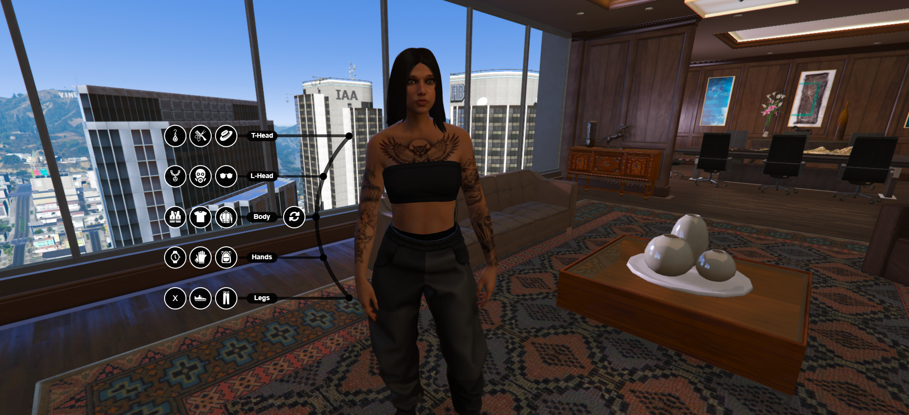

# DP Clothing — Custom NUI Edition

A visually redesigned version of the popular **[dpclothing](https://github.com/andristum/dpclothing)** script for FiveM, featuring a fully custom, modern **NUI interface** built by **iFaisal Studio**.

All core functionality remains from the original script (clothing variations, toggles for gloves, vest, top, hair, bag, and more) — this edition focuses entirely on a redesigned, modern user experience.



---

## ✨ What's New

- 🎨 **Brand-new modern UI** — completely redesigned from the ground up, replacing the original interface
- ⚡ Smoother, more intuitive navigation between clothing categories
- 🖥️ Clean, polished visual style built for a better in-game experience

> Core script logic and features are unchanged from the original — this is a UI overhaul, not a functionality rewrite.

---

## 📦 Requirements

- FiveM Server
- QBCore Framework
- Original **dpclothing** dependencies (see the [original repository](https://github.com/andristum/dpclothing) for full details)

---

## 🛠️ Installation

1. Download or clone this repository into your server's `resources` folder.
2. Add the following to your `server.cfg`:
   ```
   ensure dpclothing
   ```
3. Configure the script as needed inside the config files.
4. Restart your server or start the resource:
   ```
   restart dpclothing
   ```

---

## 🙏 Credits

- Original script by **[andristum](https://github.com/andristum/dpclothing)** and contributors
- Custom NUI design & redesign by **[iFaisal Studio](https://fasr.sa)**

---

## 📬 Support

Need a custom script or a UI redesign for your own FiveM server?
Reach out via [Telegram](https://t.me/xifai9al) or visit **[fasr.sa](https://fasr.sa)**.
